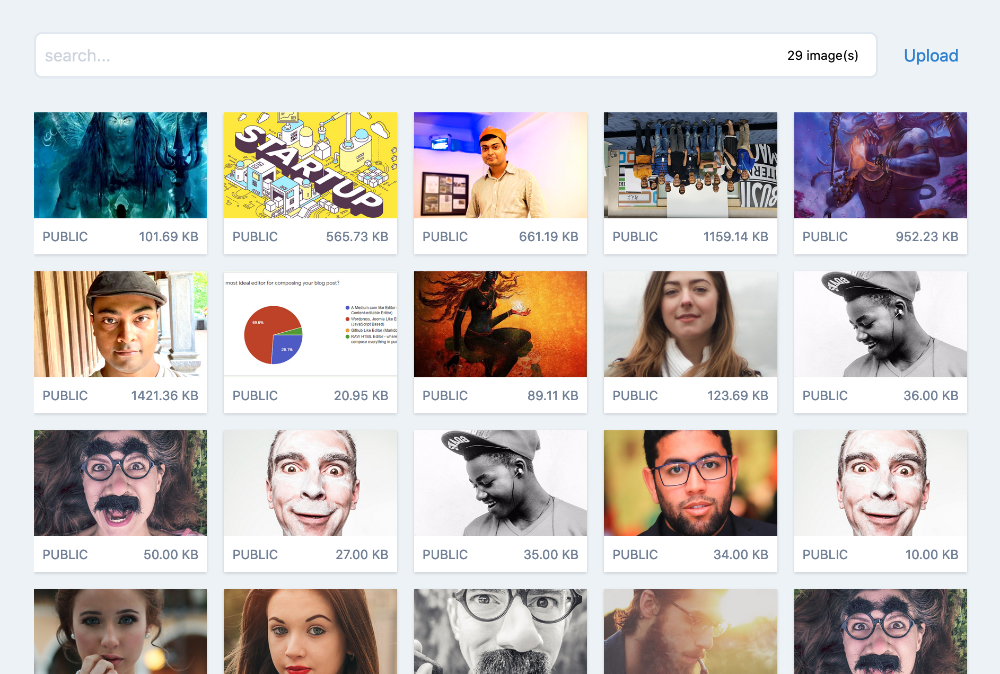
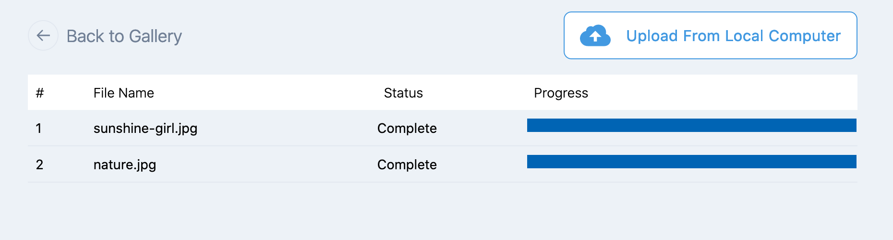

# An Image Browser Component Built with VueJs



A JavaScript Image Browser written in [VueJS](https://vuejs.org/) and styled with [TailwindCSS](https://tailwindcss.com/docs/installation/).

## Features
- Image Upload
- Local or Remote Image Search
- Show larger image (Photo Pane view)
- Delete Image
- Show arbitrary information about the image
- Generate Or Capture Image Caption
- Lazy Load Images on scroll

## Usage

Install as npm package

```
npm install @akashmitra/vue-image-browser
```

`import` this as a component. You may also use this inside another Vue component.

```javascript
<template>

    <VueImageBrowser
        :images="photos"
        :image-properties="photoFields"
        allow-upload
        allow-delete
        enable-lazy-load>
    </VueImageBrowser>

</template>
<script>
import VueImageBrowser from '@akashmitra/vue-image-browser'

export default {
    components: {
        VueImageBrowser,
    },
    data() {
        return {
            photos: [
                {'id': 1, 'name': 'sunflower.jpg', 'url': '/images/sunflower.jpg'},
                {'id': 2, 'name': 'rose.jpg', 'url': '/images/rose.jpg'},
                {'id': 3, 'name': 'tulip.jpg', 'url': '/images/tulip.jpg'},
            ],
            photoFields: {
                'id': 'Image ID', 'name': 'File Name', 'url': 'Image Location'
            }
        }
    }
}
</script>

```

## Image Object

The `images` attribute in `VueImageBrowser` accepts an array containing one or more "image objects" with following mandatory fields - `id`, `name` and `url`. The image object can contain other fields as well. You can specify the additional fields in `image-properties` as key-value pairs, where the `key` is the attribute name and the `value` is the attribute title.


## Image Upload Response



It is possible to upload an image to a specified API endpoint (`save-url`) via POST.
When an image is uploaded successfully, a 200 HTTP Status code response must be sent back from the server with a response JSON. After the image is uploaded successfully, a `saved` event will be generated and the response JSON will be passed with the event. Please see the example section below.


## Options

| Parameter              | Type    | Default Value | Description                                                                                                                                                                                      |
|------------------------|---------|---------------|--------------------------------------------------------------------------------------------------------------------------------------------------------------------------------------------------|
| `images`               | Array   | `[]`          | An array containing the image objects. Each image object must contain `id`, `name` and `url` of the image                                                                                        |
| `image-properties`     | Object  |               | An object containing all the fields in image object along with the field titles                                                                                                                  |
| `allow-upload`         | Boolean | false         | (OPTIONAL) Whether or not to provide provision for image upload. If this is `true`, a `save-url` must be provided.                                                                               |
| `save-url`             | String  | /api/photos   | Specify the URL endpoint for posting the uploaded images.                                                                                                                                        |
| `save-request-headers` | Object  | `{}`          | (OPTIONAL) If you need to pass any additional HTTP headers, you may do so by providing the header names and values in this object                                                                |
| `allow-photo-pane`     | Boolean | false         | (OPTIONAL) When this attribute is true, clicking on an image in the gallery will show a larger version of the image in a Photo pane, along with any additional image information.                |
| `allow-delete`         | Boolean | false         | (OPTIONAL) Whether or not to provide a provision for deleting an image in Photo Pane view. If this is true, delete button will be shown and a `deleted` event will be generated                  |
| `allow-choose`         | Boolean | false         | (OPTIONAL) Whether or not to provide a provision for chosing the image inside Photo Pane view. If this is true, a "Choose" button will be displayed and a `chosen` event will be generated       |
| `allow-copy`           | Boolean | true          | (OPTIONAL) Whether or not to provide a provision for copying the image URL in the Photo Pane View. If this is true, a `Copy Link` button will be shown and image `url` will be copied to clipboard |
| `captionable`          | Boolean | false         | (OPTIONAL) Whether or not to provide a provision for specifying the image caption after selecting an image. If this is true, a prompt will be shown for image caption when users select an image |
| `enable-lazy-load`     | Boolean | true          | (OPTIONAL) Uses IntersectionObserver to ensure the images are only loaded to browser when the image comes near the browser viewport                                                              |
| `search-delay`         | Number  | 500           | (OPTIONAL) A delay in miliseconds after which the search event is fired.                                                                                                                         |
| `max-images-per-row`   | Number  | 5             | (OPTIONAL) Maximum number of images to be displayed in each row in image gallery. Must be a value from 1 to 6. Actual number of displayed images will vary based on screen-size                  |


## Events

Following events are generated when performing various interactions with the images.

| Event         | Parameter Type  | Parameter Value   |  Description                                                                                                                                                              |
|---------------|-----------------|-------------------|---------------------------------------------------------------------------------------------------------------------------------------------------------------------------|
| `searched`    | String          | seach phrase      | This event is generated when users search in the search box. The search phrase is passed to the event handler, which can be used to filter the images array               |
| `selected`    | Object          | image             | This event is generated when users click on an image in the Gallery. The image is passed to the event handler.                                                            |
| `chosen`      | Object          | image             | This event is generated when users select an image. The image is passed to the event handler.                                                                             |
| `saved`       | Object          | image             | This event is generated when users successfully upload an image. The image is passed to the event handler.                                                                |
| `deleted`     | Object          | image             | This event is generated when users delete an image. The image is passed to the event handler.                                                                             |


## Example

```javascript
<template>


        <VueImageBrowser
            :images="photos"
            :image-properties="imageFields"
            allow-photo-pane
            allow-choose
            allow-upload
            allow-delete
            enable-lazy-load
            save-url="/api/media"
            :save-request-headers="headers"
            @selected="onSelect"
            @chosen="onChoose"
            @saved="onSave"
            @deleted="onDelete"
            @searched="onSearch"
            >
        </VueImageBrowser>


</template>

<script>

import VueImageBrowser from '@akashmitra/vue-image-browser'

export default {
    components: {
        VueImageBrowser,
    },
    data() {
        return {
            photos: [],
            headers: {
                "X-CSRF-Token": document.head.querySelector('meta[name="csrf-token"]').content
            },
            imageFields: {
                'id': 'File ID',
                'name': 'Image Name',
                'url': 'url',
                'size': 'File Size (KB)',
                'type': 'Image Type',
            }
        }
    },

    created() {
        this.getFromServer()
    },

    methods: {
        onDelete(image) {
            // make an ajax call to server to delete the image
            // TODO
            // on ajax success, remove the image from your list
            for(let i = 0; i < p.photos.length; i++) {
                let photo = p.photos[i]
                if (photo.id === image.id){
                        p.photos.splice(i, 1)
                        break
                }
            }
        },

        onSelect(image) {
            console.log('on select', image)
        },

        onSearch(query) {
            this.getFromServer(query)
        },

        onSave(image) {
            this.photos.unshift(image)
        },

        getFromServer(search_phrase) {
            // search the images on server based on the search phrase
        },

    }
}
</script>


```

## Dependency

[TailwindCSS](https://tailwindcss.com/docs/installation/) must be present for the styling.